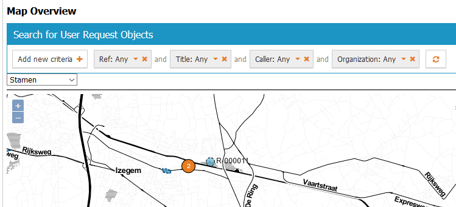

# jb-geom-pro

## Special note
This extension was complex to develop and is now very feature rich, so this became a professional extension.
If you want to use this extension and get support, get in touch please to discuss terms: jbostoen.itop@outlook.com

## What?
Adds a geometry to specified classes. 

This extension relies on the presence of an attribute named **geom** in the class.
It can be added by modifying the datamodel in a minimal way.

Objects with this attribute will have a **geometry tab** which shows a map with the feature (Point, LineString, Polygon).
There's also a **dashlet** to show all objects of a class on a map.

**Geometry tab features**
* Adding, modifying or clearing the feature from the object details is very straight forward.
* Last used basemap is remembered per user and per class (cookie)

**Dashlet features**
* search form with a look similar to iTop's native search for objects
* a feature can be clicked upon to see its details in a popup. Customizable which attributes (text-based only) are shown.
* if a feature is clicked on while holding the [Alt]-key, iTop immediately redirects to the object details page
* if enabled, clicking on an empty spot on the map will result in redirection to a new object creation page with geometry (Point) prefilled.
* if enabled, objects are clustered on zooming out. Hovering over the cluster gives a sneak peak of the clustered features.
* last used basemap is remember per user and per dashlet (cookie)

**Configuration options**
* set defaults for all maps and set more specific defaults per class (if required)
* options
  * default zoom level
  * default map center
  * limit which types of features are allowed
  * set source CRS (coordinate reference system)
  * set target CRS (coordinate reference system)
  * set basemaps (such as OpenStreetMap, Toner, WMS, ... anything OpenLayers supports)
  * set default basemap
  * ...

**Custom PHP Interface**
* With this interface, additional controls can be added above the map; such as a geolocator.

## Screenshots

## Cookbook
XML: 
* adds a new field 'geom' to some classes (Location, UserRequest, ...)

PHP: 
* how to work with iApplicationUIExtension::OnDisplayRelations()
* how to add menus with iPopupMenuExtension::EnumItems()
* how to get current module settings (utils::GetCurrentModuleName(), utils::GetCurrentModuleDir())
* how to obtain a list of all iTop attribute names to check if an attribute is present ('geom')
* how to get the label (translation) of attributes
* how to add a CSS style, a CSS stylesheet, additional JavaScript libraries, JavaScript and HTML code
* how to create a custom dashlet
* how to hide a field
* ...

JS:
* copy object with its geometry to GeoJSON (clipboard)

iTop internals
* how to redirect to iTop new object creation page AND prefill information

# Configuration
In an XML, you can find settings to adjust these options.
It's possible to specify both default settings and override them for any given class.

* **dataformat**: String. Features are stored in this format. Allowed values: 'GeoJSON', 'WKT' (highly recommended: WKT)
* **datacrs**: String. Features are stored in this CRS. Often 'EPSG:3857' (CRS used by Google Maps, OpenStreetMap WMS) or 'EPSG:4326' (GeoJSON. CRS used by Google Earth, OpenStreetMap database)
* **datatypes**: Array of one or more strings. Specifies which geometry types can be drawn. Only SinglePoint features supported right now (no MultiPoint). Allowed values: 'Point', 'LineString', 'Polygon'
* **mapcrs**: String. Specifies the CRS in which the map is displayed. Example: 'EPSG:3857'
* **mapcenter**: Array of coordinates. Centers the map to this point, if no feature has been drawn yet (otherwise it will center to the feature).
* **mapzoom**: Integer. Zoom level.
* **basemaps**: Hash table. Specify which basemaps can be picked. (limited to types supported by OpenLayers)
* **basemap**: String. Default basemap.

# Limitations
* Currently 1 feature per object. 
  * It has to be a SinglePoint, SingleLineString or SinglePolygon. 
  * MultiPoint, MultiLineString, MultiPolygon or other geometries are unsupported.
* Complex features with lots of points may be too large to store. (unlikely)
* Currently stored as an AttributeString (so not a MySQL geometry field). This is done to limit future compatibility issues with iTop.
* Background layers (such as OpenStreetMap) require an active internet connection. However, it's possible to run a GIS server offline.
* Bulk modification: there's no map, just a field with a textual presentation of the coordinates.

# Good to know
* Using QGIS Desktop (open source and free), the data can be quickly visualized (not edited!) and geospatial analysis can be performed.

# Roadmap
* Search bar (locate addresses)

## License
https://www.gnu.org/licenses/gpl-3.0.en.html
Copyright (C) 2019 Jeffrey Bostoen

