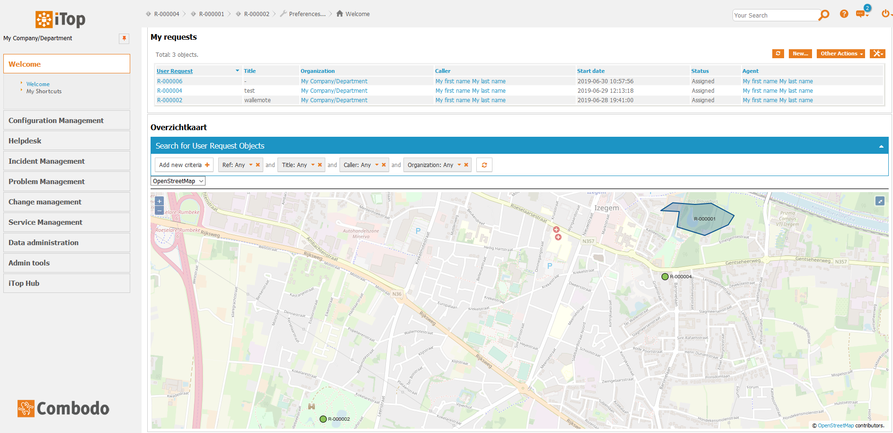

# jb-geom

## Special note
Because of the complexity, this is now a professional extension.
If you want to use this extension, get in touch please.

## What?
Adds a geometry to specified classes. The field is named 'geom'. You can change the datamodel and add it to any object.

Objects with this geom field, will show an OpenStreetMap tab depicting the feature (Point, LineString, Polygon).

There's also a dashlet to show all objects of a class on a map. 
It offers a look similar to iTop's native search for objects. 
A feature can be clicked upon to see its details in a popup.
If a feature is clicked on while holding the [Alt]-key, iTop immediately redirects to the object details page.
Clicking on an empty spot will result in redirection to a new object creation page with geometry (Point) prefilled.

It's possible to only show certain attributes in the popup, although 'id' and 'friendlyname' are always shown. 
'geom' is also available in the object/feature properties, but never visible in the popup.

The last used basemap is remembered per user for each class and dashlet.

## Screenshots

## Cookbook
XML: 
* adds a new field 'geom' to some classes (Location, UserRequest, ...)

PHP: 
* shows how to work with iApplicationUIExtension::OnDisplayRelations()
* shows how to add menus with iPopupMenuExtension::EnumItems()
* how to obtain a list of all iTop attribute names to check if an attribute is present ('geom')
* how to get the label (translation) of attributes
* how to add a CSS style, a CSS stylesheet, additional JavaScript libraries, JavaScript and HTML code
* how to create a custom dashlet
* ...

JS:
* copy object with its geometry to GeoJSON (clipboard)

iTop internals
* how to redirect to iTop new object creation page AND prefill information

# Configuration
In the iTop configuration, you can find settings to adjust these options.
It's possible to specify both defaults or class specific settings.

* dataformat: String. Features are stored in this format. Allowed values: 'GeoJSON', 'WKT'
* datacrs: String. Features are stored in this CRS. Often 'EPSG:3857' (CRS used by Google Maps, OpenStreetMap WMS) or 'EPSG:4326' (GeoJSON. CRS used by Google Earth, OpenStreetMap database)
* datatypes: Array of strings. Specifies which geometry types can be drawn. Only SinglePoint features supported right now (no MultiPoint). Allowed values: 'Point', 'LineString', 'Polygon'
* mapcrs: String. Specifies the CRS in which the map is displayed. Example: 'EPSG:3857'
* mapcenter: Array of coordinates. Centers the map to this point, if no feature has been drawn yet (otherwise it will center to the feature).
* mapzoom: Integer. Zoom level.

A cookie remembers for 30 days the last chosen basemap - per user, per class or dashlet.

# Limitations
* currently 1 feature per object. It has to be a SinglePoint, SingleLineString or SinglePolygon. MultiPoint, MultiLineString, MultiPolygon or other geometries are unsupported.
* if you have really complex features with lots of points, it may be too large to store. Probably won't happen.
* currently stored as an AttributeString (so not a MySQL geometry field).

# Good to know
* Using QGIS Desktop (open source and free), you can easily visualize the data and do all sorts of geospatial analyses.

## License
https://www.gnu.org/licenses/gpl-3.0.en.html
Copyright (C) 2019 Jeffrey Bostoen

