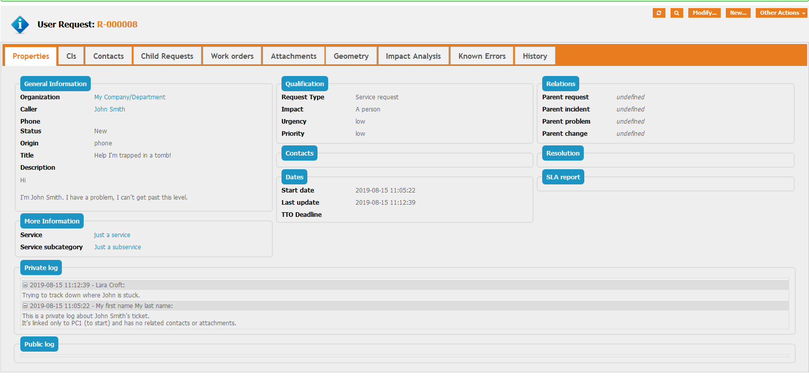

# jb-ticket-merge

Can't be used for now. Near complete.
Developed in personal time.

If you are interested in a quick development of this extension or a specific feature, consider getting in touch and sponsor it.

## What?
Merges objects (primarily meant for any subclass of Ticket)

Generic approach, but primarily aimed at subclasses of Ticket.
One Ticket is chosen as "target" Ticket. User decides which ticket will be kept as main Ticket, and which ones will be merged.

The attribute types to be merged are:
* AttributeCaseLog - merges case log entries (sorted chronologically!) + possible append/prepend
* AttributeLinkedSet - related WorkOrders, ...
* AttributeLinkedSetIndirect - related functional CIs, functional Contacts, ...

Attachments may be copied to the target Ticket.

There will be a variety of options:

* specify which attributes can be merged, which ones are merged by default, which ones are always merged, ...

* perform actions on target object as well as merged objects, similar to Combodo's User Actions Configurator.
** on all objects: apply stimulus (so they can be resolved/closed automatically), set attributes, append log entries, ...
** retrofit from target object to merged objects: copy (attributes), copy_head (most recent case log entry)

* add callers from merged Tickets on the related contacts tab of the target Ticket. This allows Notifications to be sent to everyone linked to this Ticket.
* add description from merged Tickets as a case log entry (for example in public_log).

## Out of scope
Ideas which will only get implemented when sponsored:
* merge Tickets into new Ticket instead of existing one
* merge different class of Tickets into one
* detailed history track (which log entries, linked sets, attachments, ... were merged and from which original Ticket?)

## Screenshots



## Cookbook

XML:
- something

PHP:
- how to introduce custom iTop pages
- how to add a menu item in the Other Actions menu
- use built-in iTop methods to obtain attribute list for a class
- use built-in iTop methods to display lists
- use built-in iTop methods to check user rights
- use built-in iTop methods to prevent malicious actions
- use DBObject::Fingerprint() for various tasks: to uniquely identify objects or look for very similar ones or see if attributes changed
- ...


## Settings

```
// Module settings, defaults.
$aModuleSettings = utils::GetCurrentModuleSetting('default', [

	'attributes' => [
		// Attributes must be one of these types: 'AttributeCaseLog', 'AttributeLinkedSet', 'AttributeLinkedSetIndirect'
		// Attributes must be specified by their attribute code. If all attributes (of the above types) are specified, it's possible to use ['*']
		
		// Attributes which can be merged for this class
		'allowed' => ['contacts_list', 'functionalcis_list', 'private_log', 'public_log'],
		
		// ['*'] can be used to include ALL attributes.
		'checked' => ['*'],
		
		// Attributes which are ALWAYS merged (enforced). Any attribute specified here should also be in the allowed list.
		'required' => ['private_log', 'public_log'],
		
	],
	
	'target_object' => [
	
		// actions applied on target_object - similar to Combodo's User Actions Configurator.
		// available actions: append, apply_stimulus, call_method, reset, nullify, set
		'actions' => [
			'apply_stimulus' => 'some_stimulus', // Similar to Combodo's User Actions Configurator. String. Stimulus code
		],
		
		// retrofit actions - similar to Combodo's User Actions Configurator.
		// takes data from the target object and retrofits it to the other merged objects.
		// available actions: copy, copy_head
		'retrofit_actions' => [
			'copy' => 'some_attribute_code'
		],
		
		// Add callers of the merged tickets to 'related Contacts' (those Contacts could be used in Notification)
		'add_callers_to_related_contacts' => true, 
	],
	
	'target_object_selection_order' => [
		// Multiple attributes can be specified. Processed in order.
		'id' => true, // Set to 'true' for sorting target objects from oldest to newest; set to false for newest to oldest
	],
	
	'merged_objects' => [
		// actions actions - sSimilar to Combodo's User Actions Configurator. 
		'actions' => [
			'apply_stimulus' => 'some_stimulus',
			'set' => [
				'<attribute_name>' => 'could be used for writeback; have $targetObj placeholder'
			],
			'add_entries' => [
				'<CaseLog_attribute_name>' => 'Entry to insert; add targetObj placeholder'
			]
		],
		'delete' => true, // Notification could be sent first. How can a placeholder be used?
	],
	
	
	// Currently unimplemented
	// --
	
	// Similar to Combodo's User Actions Configurator. The OQL to define the source objects. 
	// The only parameter available is current_contact_id.
	'source_scope' => '',
	
	// Similar to Combodo's User Actions Configurator. 
	// CSV list of profiles allowing the shortcut. 
	// The user must have at least one profile to have the shortcut available. 
	// Wrong profiles names are ignored. Set as an empty string to allow the shortcut to anybody.
	'allowed_profiles' => '', 
	
]); 

```

## License
https://www.gnu.org/licenses/gpl-3.0.en.html
Copyright (C) 2019 Jeffrey Bostoen
